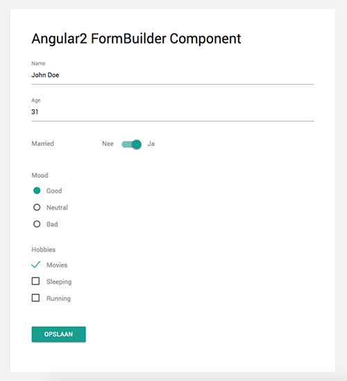

## Angular2 FormBuilder Component
An implementation of the @angular/forms's FormBuilder

## Supports following form fields
- Input
- Switch (boolean)
- Radio
- Checkbox

### 1. Define a model
```javascript
export interface User {
    id?: string;
    name: string;
    age: number;
    image: string;
    hobbies: any;
    married: boolean;
    mood: string;
}
```

### 2. Create form settings for the model (label, type, disabled, required, presets)
```javascript
export const userFormSettings: any = {
    name:       new FormConfig({label: 'Name',       type: 'input',  disabled: false, required: true}),
    age:        new FormConfig({label: 'Age',        type: 'input',  disabled: false, required: true}),
    image:      new FormConfig({label: 'Afbeelding', type: 'upload', disabled: false, required: false}),
    married:    new FormConfig({label: 'Married',    type: 'switch', disabled: false, required: false}),
    mood:       new FormConfig({label: 'Mood',       type: 'radio',  disabled: false, required: false,
        presets: { 'Good': false, 'Neutral': false, 'Bad': false }}),
    hobbies:    new FormConfig({label: 'Hobbies', type: 'checkbox', disabled: false, required: false,
        presets: { 'Movies': false, 'Sleeping': false, 'Running': false }})
};
```

### 3. Get entity from database/API or create new entity with empty object

### 4. Add form builder element with entity and settings @Input() and saveForm @Output()
```html
<form-builder *ngIf="user" [entity]="user" [settings]="userFormSettings" (saveForm)="saveForm($event)"></form-builder>
```

### 5. Result

